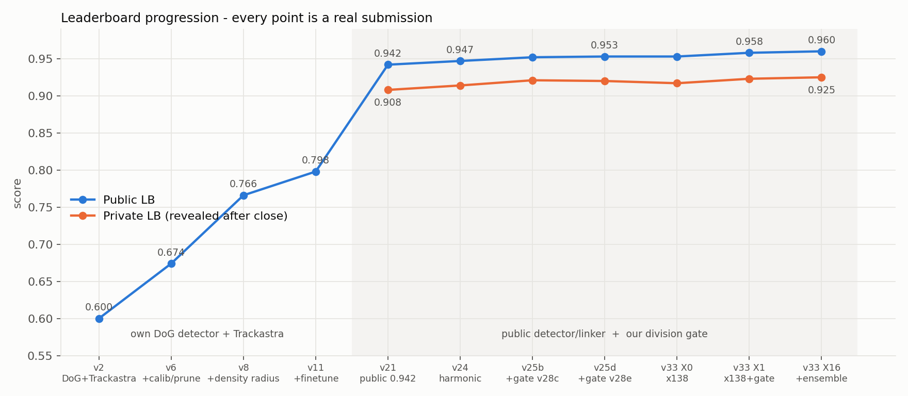

# Biohub – Cell Tracking During Development (Kaggle) — 전체 진행 기록

제브라피시 배아의 3D+시간 형광 현미경 영상에서 세포를 검출하고, 시간축으로 연결하고, 세포 분열을 찾아 계보(lineage) 그래프를 만드는 Kaggle 코드 대회.
2026-09-06 ~ 09-29, 3주 동안 **공개 LB 0.600 → 0.960** (private 0.925, **156위 / 4,020팀**)까지 올린 과정을 처음부터 끝까지 기록한 저장소입니다.

> **솔루션 write-up(Kaggle 형식): [WRITEUP.md](WRITEUP.md)**
>
> 이 저장소에는 노트북·빌더 스크립트·작업 노트·그림만 있습니다. **대회 데이터는 포함하지 않습니다**(규칙 2.4b, 비참가자 재배포 금지 — [Kaggle 데이터 페이지](https://www.kaggle.com/competitions/biohub-cell-tracking-during-development/data)에서 받으세요). 학습 가중치와 공개 노트북 원본도 포함하지 않으며, 가중치는 Kaggle Datasets(pilkwang)와 우리 학습 노트북 Output에서 첨부합니다. 제3자 코드의 출처와 라이선스는 [NOTICE.md](NOTICE.md). 메트릭 해킹(가짜 노드 추가, 실제 노드 삭제로 노드 수 페널티를 이용하는 방식)은 처음부터 끝까지 사용하지 않았습니다.

| | |
|---|---|
| 대회 | [Biohub - Cell Tracking During Development](https://www.kaggle.com/competitions/biohub-cell-tracking-during-development) · 호스트 Chan Zuckerberg Biohub · 상금 $60k |
| 형식 | Code competition · GPU T4×2 · 노트북 12h 제한 · 인터넷 차단 · 제출 5회/일 · GPU 30h/주 |
| 데이터 | train 199클립(배아 2종), hidden test ≈200클립(다른 배아 2종). 클립 = 100프레임 × 64×256×256 voxel. GT는 희소(세포의 ~3%만 라벨) |
| 평가 | `score = adjusted_edge_jaccard + 0.1 × division_jaccard` |
| 최종 | **Public 0.960 / Private 0.925 · 156위 / 4,020팀** (예비 순위) · 선택 제출 X11(5시드 앙상블 @0.55) + X1(단일 @0.80) |



---

## 목차

1. [결과 요약](#1-결과-요약)
2. [문제와 데이터](#2-문제와-데이터)
3. [최종 파이프라인](#3-최종-파이프라인)
4. [단계별 진행](#4-단계별-진행) — 4-1 DoG+Trackastra · 4-2 자체 학습 · 4-3 공개 파이프라인 · 4-4 분열 분류기 · 4-5 x138 이식 · 4-6 앙상블 보정 · 4-7 검증기의 한계
5. [전체 제출 기록](#5-전체-제출-기록)
6. [Public → Private](#6-public--private)
7. [저장소 구성과 재현](#7-저장소-구성과-재현)
8. [배운 것](#8-배운-것)

---

## 1. 결과 요약

점수는 서로 독립인 세 축의 합이었습니다. 각 축은 따로 검증한 뒤 합쳤고, 합친 결과가 각각의 이득을 그대로 더한 값이었습니다 — public과 private 양쪽에서.


| 축 | 무엇 | 출처 | Public 기여 | Private 기여 |
|---|---|---|---|---|
| 엣지(링크) | flow 사전분포 relink, 저점수 검출 재입장, 서브임계 갭 메우기, 좌표 보정 헤드 | 공개 x138 노트북 (그대로 사용) | 0.947 → 0.953 (+0.006) | 0.914 → 0.917 (+0.003) |
| **분열** | 기하 후보를 학습된 3D-CNN으로 채점해 게이팅 | **우리** | 0.953 → 0.958 (+0.005) | 0.917 → 0.923 (+0.006) |
| **앙상블 보정** | 5시드 sigmoid 평균의 눌린 확률에 맞춰 임계값 0.80 → 0.55 | **우리** | 0.958 → 0.960 (+0.002) | 0.923 → 0.925 (+0.002) |

한 줄 요약: **공개된 최고 검출·링킹 파이프라인 위에, 그 파이프라인에서 유일하게 학습 신호가 없던 단계(분열 결정)에 분류기를 넣었다.** 분류기는 파이프라인이 실제로 만드는 후보를 덤프해 희소 GT로 라벨링한 1,564개 샘플로 학습했고, 임계값은 로컬 검증기가 아닌 LB 곡선으로 골랐다.

---

## 2. 문제와 데이터

**과제.** 각 프레임의 세포 중심 좌표(노드)와 프레임 간 연결(엣지)을 예측. 한 노드에서 두 노드로 갈라지는 엣지가 분열. 제출은 노드 행(`t, z, y, x`)과 엣지 행(`source_id, target_id`)의 CSV.

**데이터.**

| | train | hidden test (public 29% / private 71%) |
|---|---|---|
| 배아 | `44b6` 71클립 · `6bba` 128클립 | `fdad`(public) · `ea36`(private) — train과 다른 배아 |
| 밀도 (프레임당 세포 수, 중앙값) | 44b6 ≈ 355 · 6bba ≈ 114 | fdad ≈ 160–260 · ea36 ≈ 60–100 (3위 솔루션 프로빙 값) |
| 볼륨 | 100 × 64 × 256 × 256, zarr v3 | 동일 |
| voxel | z 1.625 µm · xy 0.406 µm | 동일 |
| 라벨 | 클립당 GT 트랙 1~12개 (전체의 ~3%), GT 분열 151개 | — |

밀도가 곧 세포 크기입니다(초기 배아는 부피가 거의 일정). 이 사실이 초반 DoG 검출기의 "클립별 자동 반경"을 낳았고, 끝까지 밀집 클립의 링크 fragmentation이 남은 손실의 대부분이었습니다.

**평가의 함정.** GT가 희소라서 라벨 없는 세포끼리의 링크는 FP가 아닙니다. FP는 GT 매칭 노드에서 GT와 다른 링크를 만들 때만 계산됩니다. 노드를 추정 세포 수보다 많이 내면 `0.1 × 초과비율` 페널티. 그래서 "분류기 정확도"나 "검출 precision" 같은 국소 지표가 최종 점수와 잘 맞지 않고, 메트릭을 그대로 재구현한 채점기가 필요했습니다(`score_official`).

**환경의 함정.** 제출 노트북은 hidden 데이터로 처음부터 다시 실행됩니다. 60클립 검증기를 켠 채 제출한 v34는 10시간짜리라 12시간을 넘겨 Timeout이 났습니다.

---

## 3. 최종 파이프라인

```mermaid
flowchart LR
  subgraph PUB["공개 x138 파이프라인 (pilkwang 가중치, 그대로 사용)"]
    A[zarr 볼륨\n100×64×256×256] --> B[TemporalUNet3D ×2\n검출 히트맵 + 엣지 특징\nxy 8-way TTA]
    B --> C[NodeTransformer\n엣지 확률]
    C --> D[tracksdata ILP\napp 0 · disapp 2 · div 1.2]
    D --> E[flow-prior motion relink\n→ readmit 저점수 검출\n→ 2차 relink]
    E --> F[gap closing 1–2f\n→ gapfill 서브임계 피크]
    F --> G[safe-division 후보 생성\n반경 9 µm · 자매 14 µm\n대칭 0.6 · 발산 2.25 µm]
  end
  subgraph OURS["우리가 넣은 것"]
    G --> H[["3D-CNN 분열 분류기\n(4프레임 × 16×32×32 부모 크롭)\n5시드 sigmoid 평균"]]
    H -->|"p ≥ 0.55 → 분열 채택\np < 0.55 → 기각"| I
  end
  I[short-track 제거 <6\n→ 선형 스무딩] --> J[submission.csv]
  style H fill:#2a78d6,color:#fff,stroke:none
```



| 단계 | 설정 | 출처 |
|---|---|---|
| 검출 | 공개 50-epoch TemporalUNet3D + 시드 314159 모델, det threshold 0.965, xy D4 TTA, edge-feature TTA(secondary weight 0.75) | x138 |
| ILP | appearance 0 · disappearance 2.0 · division 1.2 · timeout 1200s | x138 |
| relink | tight 5.5 µm · flow gate 7.0 µm · flow K 12 · readmit 반경 4 µm / 점수 ≥ 0.965 | x138 |
| gapfill | 서브임계 피크 ≥ 0.5 · 최대 3프레임 · 좌표 보정 헤드(V1284) | x138 |
| **분열 게이트** | **v28f 5시드 앙상블, threshold 0.55 (0.45~0.55 구간은 점수 동일), DeepCenter 거부 off** | **ours** |
| 후처리 | 6노드 미만 성분 제거 · 선형 스무딩 | x138 |

실행 시간 약 25분(T4×2). Kaggle Input: Competition + `pilkwang/biohub-tracking-support-pack-50ep-v1` + `pilkwang/biohub-temporal-unet3d-seed314159-v1` + `pilkwang/biohub-deepcenter-unet3d-center-prior-v1` + `biohub-v1284-head-s075` + 분류기 학습 노트북 Output.

---

## 4. 단계별 진행

### 4-1. DoG 검출 + Trackastra (v2 ~ v12) — LB 0.600 → 0.798

`notebooks/01_trackastra_dog/` · `src/pipeline.py` · `src/make_synthetic.py`

인터넷이 차단되므로 준비 노트북에서 wheel 44개 + Trackastra CTC 사전학습 모델을 받아 Output으로 넘기고, 제출 노트북은 `/kaggle/input` 아래를 자동 탐색해 오프라인 설치. 로컬 e2e 검증용으로 대회와 같은 zarr v3/geff 레이아웃의 합성 데이터 생성기를 만들었습니다.

| 버전 | 변경 | 12클립 CV | LB |
|---|---|---|---|
| v2 | 비등방 DoG + 국소 최댓값 → 구형 pseudo-mask → Trackastra greedy | — | 0.600 |
| v4 | + 임계값 캘리브레이션(geff 메타 `estimated_number_of_nodes`에 검출 수를 맞춤) + 분열 프루닝(2번째 자식 weight ≥ 0.5, ≤ 8 µm, 노드의 0.6% 예산) | 0.558 | 0.623 |
| v6 | 검출 반경 3.5 → 4.0 µm | 0.641 | 0.674 |
| v7/v8 | **클립별 자동 반경** `r = 26.5 × N^(−1/3)` (3.0~6.0 µm) + 병합 | 0.793 | 0.766 |
| v11/v12 | + Trackastra 파인튜닝 | 0.818 | 0.798 |

핵심 발견은 CV 2라운드에서 나왔습니다: 반경 5.0 µm는 희소 배아(6bba)에서 0.86~0.95인데 밀집 배아(44b6)에서는 recall이 0.51까지 추락. 배아마다 세포 크기가 다르니 hidden 배아에 고정 반경은 위험 → 프레임당 검출 수 N으로 반경을 자동 결정(N≈400 → 3.5, 210 → 4.5, 50 → 6.0, 각 클립 최적과 일치).

한계: 고전적 DoG는 밀집 영역과 분열 직후(딸세포 간격 < 반경)를 놓침. 0.9+에는 학습 검출기가 필요.

### 4-2. 공식 baseline 자체 학습 (v13 ~ v17) — CV 0.855

`notebooks/02_own_baseline_training/` · `src/cellmot_train.py` · `src/cellmot_infer.py`

주최측 저장소(royerlab)의 TemporalUNet3D(32-64-128, (1,4,4) 서브샘플) + SimpleNodeTransformer(2.08M 파라미터)를 Kaggle T4×2에서 학습. 저장소 코드는 그대로 import하고 래퍼만 추가:

- 전체 resume(model + optimizer + epoch), 12h 세션용 시간 예산 중단, cosine LR, 매 epoch last/best 저장
- **프레임당 검출 top-K 상한(1200)** — 초반 미숙 검출기가 수천 개 피크를 내면 어텐션 n² 메모리가 폭발(6 GiB OOM)
- 12클립 홀드아웃을 메트릭 규칙 그대로 채점

실측 epoch당 ~2.5h. 4 epoch에서 val recall 0.9465. 추론을 `predict_raw`(네트워크, npz 캐시) / `postprocess`(엣지 임계값 → tracksdata ILP 또는 greedy → 짧은 트랙 제거)로 분리해 CPU에서 후처리를 스윕:

| 후처리 | CV |
|---|---|
| greedy 연결 | 0.64~0.66 |
| ILP (t95) | 0.820 |
| ILP + TTA | 0.837 |
| ILP + TTA + det 0.99 + min_track_len 5 | **0.855** |
| 〃 min_track_len 10 | 0.851 (과잉 가지치기) |

ILP를 spawn ProcessPool로 GPU와 병렬화(v17)해 hidden 200클립을 12h 안에 처리하도록 준비했지만, 4 epoch 모델의 0.855는 공개 50-epoch 가중치의 LB 0.913~0.94와 격차가 커서 **공개 가중치 + 후처리 개선**으로 전환했습니다.

### 4-3. 공개 파이프라인 재현과 대조 (v18 ~ v24) — LB 0.942 → 0.947

`notebooks/03_public_pipeline/` · `builders/build_pub_pipeline_notebook.py`, `build_v24_tta_notebook.py`

여기서 이후 모든 실험의 방식이 정해졌습니다: **공개 노트북을 셀 단위로 그대로 두고, 환경변수 오버라이드를 적용하는 `VARIANT` 셀 하나만 삽입.** 빌더 스크립트가 원본 `.ipynb`를 읽어 정확한 문자열 앵커로 패치하고, 앵커가 하나가 아니면 실패합니다. 원본과의 diff가 항상 명확하고, 새 공개 노트북이 나오면 같은 패치를 옮기기 쉬웠습니다.

| 버전 | 내용 | LB |
|---|---|---|
| v18~v20 | 공개 50ep 가중치를 우리 파이프라인에 넣어 CV·LB A/B (그 가중치가 학습에 안 쓴 클립만으로 "honest CV") | 0.93~0.94 |
| v21 | 공개 0.942 노트북(analyticaobscura → nusrati → pilkwang 계열) 재현 | 0.942 |
| v22/v23 | 공개 400ep 가중치를 저 LR로 이어 학습해 3번째 시드로 융합 시도 | 개선 없음 |
| v24 | 공개 harmonic-fusion (dual model + edge-feature TTA + DeepCenter TTA + 8클립 홀드아웃 후처리 스윕 → tight55) | **0.947** |

공개 노트북 7개를 코드 diff로 대조한 결과, 이름·설명이 달라도 실제 코드가 다른 것은 2개(harmonic-fusion 0.947, x138 0.953)뿐이었고, 검출 임계값 0.96 vs 0.965는 효과 0이었습니다.

### 4-4. 자체 분열(mitosis) 분류기 (v25 ~ v31) — LB 0.947 → 0.953

`notebooks/04_division_classifier/` · `src/divnet_blk1.py`, `divnet_blk2.py` · `builders/build_v25*.py`, `build_v28*.py`, `build_v30*.py`, `build_v31*.py`

**발견.** 공개 노트북들이 싣고 다니던 "DivNet" 분류기는 실제로는 **한 번도 호출되지 않는 코드**였습니다(`if OUTPUT_DIVISION_GEOMETRY_FILTER:` 안, 값은 False; 게다가 6-D 텐서 버그를 try/except가 삼켜 로그에도 안 남음). 분열은 `add_safe_divisions_postlink`의 기하 조건 + DeepCenter 히트맵 거부로만 결정되고 있었습니다. 전체 파이프라인에서 유일하게 학습 신호가 없는 단계였습니다.

**학습 데이터 (v28/v28b/v28d).** 희소 GT에서 분열 라벨을 직접 만들 수 없어 **파이프라인이 실제로 보는 후보를 그대로 덤프**했습니다.

1. harmonic 파이프라인의 검증기를 train 60클립(타입별 30)에 켜고, safe-division 후보 생성기를 후킹 → 모든 기하 후보 (부모, 기존 자식, 후보 자매) 저장
2. 7 µm 이분 매칭으로 라벨: 부모가 GT 분열 노드이고 후보가 그 딸 → 1 / 부모가 GT 노드인데 자식이 하나 → 0 / 미매칭 → 제외
3. GT 분열 위치의 크롭을 양성으로 추가 (195클립 전체)
4. v28d에서 80클립 추가. 남은 55클립은 전부 6bba로 GT 분열이 0개라 사용 불가

→ 총 1,564 샘플 / 양성 183.

**모델.** 부모 중심 크롭 4프레임(t..t+3, 마지막 프레임 클램프)을 채널로 쌓은 (4, 16, 32, 32) 입력의 작은 3D-CNN. z_pad 8 / xy_pad 16, 크롭별 평균·표준편차 정규화. 60 epoch, BCE, AdamW.

| 체크포인트 | 학습 클립 | 시드 | 홀드아웃 AUC | 최적 임계값 | LB (harmonic / x138 위) |
|---|---|---|---|---|---|
| v28c | 60 | 1 | 0.948 | 0.80 | 0.952 / — |
| v28e | 140 | 1 | 0.959 | 0.75~0.80 | 0.953 / 0.958 |
| **v28f** | 140 | **5** | 0.962 | **0.45~0.55** | 0.945(@0.80) / **0.960** |

**게이트 (v25).** 분열이 결정되는 후보 루프에, DeepCenter 거부 바로 뒤에 `분류기 확률 ≥ threshold` 조건을 삽입. DeepCenter 거부는 끄는 편이 일관되게 나았습니다(harmonic: 0.947 → 게이트만 0.952 / x138: 게이트+거부 0.955 vs 게이트만 0.958). 크롭이 부모 좌표만으로 정해지므로 (클립, t, 부모 좌표) 키로 memo해 같은 후보를 두 번 채점하지 않습니다.

**진단 (v30/v31).** 60클립의 GT 분열 78개를 원인별로 분류:


가장 큰 버킷의 "다른 부모"를 v31에서 추적하면 전부 진짜 부모에서 5~7 µm 이상 떨어진 **GT 미매칭 노드 = annotation 없는 진짜 이웃 세포**였습니다(중복 검출이 아님, 31/35에 들어오는 엣지가 있음). 딸 #2를 진짜 부모로 되돌리는 가로채기(v25f, 분류기 게이트 포함)와 중복 부모 병합(v31)은 LB 중립. 기하 조건 완화는 −0.013. 이 손실은 링킹 단계에서 이웃 세포와 경쟁을 이겨야 풀리는 문제이고, 3위 솔루션이 "링크와 분열을 공동 최적화"한 이유와 정확히 같은 지점입니다(WRITEUP §9).

### 4-5. 공개 x138 위에 이식 (v33) — LB 0.953 → 0.958

`notebooks/05_x138_final/biohub_v33_x138_divnet_variants.ipynb` · `builders/build_v33_x138_gate_notebook.py`

마감 일주일 전 공개된 x138(= harmonic-fusion-v3_2 = 0.953-original, 셋 다 코드 동일)은 **엣지만** 고친 노트북입니다: 이웃 세포 중앙값 흐름을 사전분포로 쓰는 motion relink, ILP가 버린 저점수 검출을 열린 트랙 끝 근처에서 재입장, 서브임계 피크로 갭 메우기, 좌표 보정 헤드, ILP 타임아웃·런타임 가드.

`add_safe_divisions_postlink`가 harmonic과 170줄 동일(diff 0)이고 처리 순서가 relink → readmit → relink → gap → gapfill → **safe-div** → short-track이라 게이트를 같은 자리에 그대로 이식할 수 있었습니다. X0(원본) 0.953 → **X1(+게이트) 0.958**. 필요한 4번째 데이터셋(`biohub-v1284-head-s075`)이 없으면 커널이 죽는 코드에 경고 후 진행하는 fallback을 넣었습니다.

### 4-6. 앙상블 캘리브레이션 (X6 ~ X17) — LB 0.958 → 0.960

5시드 앙상블(v28f)은 홀드아웃 AUC가 단일보다 높은데 LB는 **0.945**(단일 0.953)로 크게 나빴습니다. 가설: 시드별 sigmoid를 평균하면 확률이 중앙으로 눌려, 단일 모델용 임계값 0.80이 사실상 0.9+ 기준이 된다. 임계값을 내려가며 LB로 검증:


| v28f 임계값 | 0.80 | 0.75 | 0.60 | **0.55** | **0.50** | **0.45** |
|---|---|---|---|---|---|---|
| Public LB | 0.945 | 0.952 | 0.957 | **0.960** | **0.960** | **0.960** |
| Private LB | 0.916 | 0.922 | 0.923 | **0.925** | **0.925** | **0.925** |

가설이 맞았고 private에서도 순서가 같았습니다. 2모델 평균(v28c+v28e)은 덜 눌려 0.75/0.80에서 0.958. 로더에 `"v28f+v28c"` 같은 멀티 체크포인트 힌트를 추가했습니다(5시드 전부 + 다른 데이터로 학습한 모델 = 6모델).

### 4-7. 홀드아웃 검증기의 한계 (v34)

x138의 새 노브(readmit/gapfill/flow)는 작성자가 검증한 적이 없어서, 60클립 홀드아웃 + 분류기 memo로 16개 후보를 스윕했습니다(10h).

| 후보 | 검증기 proxy Δ | LB Δ |
|---|---|---|
| flow gate 7→6 + K 12→16 (선택됨) | **+0.0016** | **−0.002** (X8/X9/X10) |
| readmit off / gapfill off | −0.0008 / −0.0008 | (미제출) |
| flow gate 8 | −0.0104 | — |
| readmit 점수·반경 변형 4종 | −0.0001 ~ −0.0015 | — |

검증기가 고른 값이 LB에서는 손해. 분류기 AUC에 이어 엣지 노브에서도 60클립 홀드아웃이 hidden 분포를 대표하지 못한다는 결론 → 마지막 주는 LB(5회/일)만 검증으로 사용.

---

## 5. 전체 제출 기록

전부 실제 제출. 굵은 글씨는 각 단계의 최고.

| 버전 | 내용 | Public | Private |
|---|---|---|---|
| v2 | DoG + Trackastra greedy | 0.600 | |
| v4 | + 임계값 캘리브레이션 + 분열 프루닝 | 0.623 | |
| v6 | 반경 4.0 | 0.674 | |
| v8 | 클립별 자동 반경 + 병합 | 0.766 | |
| v11/v12 | + Trackastra 파인튜닝 | 0.798 | |
| v13~v17 | 공식 baseline 자체 학습 4 epoch | (CV 0.855) | |
| v18~v20 (p3~p15) | 공개 가중치 + 우리 파이프라인 | 0.930~0.942 | 0.903~0.911 |
| v21 P0 | 공개 0.942 재현 | 0.942 | 0.908 |
| v24 Q1/Q0 | harmonic-fusion (+스윕 tight55) | **0.947** | 0.914 |
| v25 R1~R3, Q5, Q7, S1 | 후처리 노브·relink 변형 | 0.944~0.946 | 0.913~0.917 |
| v25b R5 | + 분류기(v28c) 게이트 0.80, DeepCenter 거부 off | 0.952 | 0.921 |
| v25b R7 / R10 / R8 | 포크 게이트 / ILP div 1.0 / 기하 완화 | 0.952 / 0.952 / 0.939 | — / — / 0.921 |
| v25c R5 @0.70 / @0.90 | | 0.952 / 0.951 | 0.922 / 0.918 |
| v25d R14 @0.80 | v28e 분류기(140클립) | **0.953** | 0.920 |
| v25d R14 @0.85 / @0.75 / @0.70 | | 0.952 / 0.952 / 0.951 | — / 0.922 / 0.922 |
| v25e R15 | R14 + 분류기 TTA 16뷰 | 0.951 | |
| v25e R17 | v28f 5시드 @0.80 | 0.945 | 0.916 |
| v25f R18 | R14 + 분열 가로채기 | 0.953 | 0.922~0.923 |
| v33 X0 | x138 원본 | 0.953 | 0.917 |
| **v33 X1** | x138 + v28e @0.80 | **0.958** | 0.923 |
| v33 X2 | X1 + DeepCenter 거부 병행 | 0.955 | 0.917 |
| v33 X3 / X4 | X1 @0.75 / @0.85 | 0.958 / 0.956 | 0.923 / 0.923 |
| v33 X8 / X9 / X10 | flow 6.0/16 · 5.0/16 · 6.0/24 | 0.956 ×3 | 0.923 ×3 |
| v33 X12 / X17 / **X11 / X16 / X15** | v28f @0.75 / 0.60 / **0.55 / 0.50 / 0.45** | 0.952 / 0.957 / **0.960 ×3** | 0.922 / 0.923 / **0.925 ×3** |
| v33 X13 / X14 | v28c+v28e @0.75 / @0.80 | 0.958 / 0.958 | 0.925 / 0.924 |
| v34 | 60클립 검증기·스윕 포함 | Timeout | |

---

## 6. Public → Private


모든 제출이 거의 같은 직선(private ≈ public − 0.035) 위에 있습니다. 읽는 법:

- **우리가 얹은 부분은 private에서도 유지됐습니다.** x138 원본 0.917 → 게이트 0.923 → 앙상블 0.925 (+0.008). 임계값 순서(0.45~0.55 > 0.60 > 0.75 > 0.80), DeepCenter 거부 병행의 손해, flow 노브의 손해 — 전부 public과 같은 방향.
- **베이스 파이프라인 구간에서 −0.035 떨어졌습니다 — 원인은 추정입니다.** 같은 public 대역(100~175위에서 3칸 간격으로 뽑은 25팀, 2026-09-30 예비 private LB 조회)의 평균 낙폭도 −0.034(중앙값 −0.034, 범위 −0.027~−0.041)여서, 우리만의 결함이라기보다 이 대역 전반의 현상입니다. 공개 harmonic/x138 계열이 public 배아(fdad, 중간 밀도)에 맞춰져 private 배아(ea36, 저밀도)에서 흔들렸다는 가설은 이 결과와 모순되지 않지만, 배아 단위 홀드아웃 없이는 확인할 수 없습니다. 참고로 3위 솔루션의 낙폭은 −0.010이었습니다. 순위는 public 133위 → private 156위.
- 우리에게 없던 것은 **배아 단위 홀드아웃**(한 배아로 학습, 다른 배아로 검증)입니다. 60클립 검증기는 두 train 배아를 섞어 썼고, 그것이 hidden 배아 분포를 대표하지 못했습니다.

---

## 7. 저장소 구성과 재현

```
README.md                     전체 진행 기록 (이 문서)
WRITEUP.md                    솔루션 write-up + 3위 솔루션 비교
NOTICE.md / LICENSE           원저작자 표기 (공개 노트북 파생물), Apache-2.0
notebooks/                    전 버전 45개, 출력 제거
  01_trackastra_dog/          prep bundle v1/v2, trackastra_inference, v7~v12
  02_own_baseline_training/   v13(+short3h), v14(+cpu CV), v15~v17
  03_public_pipeline/         v18~v24 (v19b, v21b/c/d, v22, v23, v24b 포함)
  04_division_classifier/     v25~v25f 게이트, v26, v28~v28f 데이터·학습, v30/v31 진단
  05_x138_final/              v33 (최종 제출, X0~X19 variant), v34 (60클립 스윕, 제출 불가)
builders/                     각 노트북을 "공개 원본 + 패치"로 생성하는 스크립트 30개
src/
  pipeline.py / make_synthetic.py       DoG + Trackastra 파이프라인, 합성 zarr/geff 생성기
  finetune.py                           Trackastra 파인튜닝
  cellmot_train.py / cellmot_infer.py   공식 baseline 학습·추론 래퍼
  divnet_blk1.py / divnet_blk2.py       분열 분류기 정의·로더 / 스코어러 (노트북에 삽입되는 블록)
  test_postprocess.py / test_post_pool.py  후처리 단위 테스트
docs/
  figures/                    이 문서의 그림 5장
  01_early_notes_0907.md      DoG/Trackastra 단계 작업 노트
  02_own_training_notes_0912.md  자체 학습 단계 작업 노트
  03_final_notes_0929.md      공개 파이프라인~최종 작업 노트
```

**최종 제출 재현.** Kaggle에서 `notebooks/05_x138_final/biohub_v33_x138_divnet_variants.ipynb`를 열고 §3의 Input 6개를 붙인 뒤 셀 2의 `VARIANT`를 고릅니다. 분류기 학습 노트북(`biohub_v28f_divnet_train_5seeds.ipynb`)의 Output이 `divnet_ours/best_overall.pt`로 필요합니다.

| VARIANT | 설정 |
|---|---|
| X0 | x138 원본 (게이트 없음, DeepCenter 거부 on) |
| X1 | + 게이트 v28e @0.80, DeepCenter 거부 off |
| X11 / X15 / X16 / X17 | 게이트 v28f 5시드 @0.55 / 0.45 / 0.50 / 0.60 |
| X13 / X14 | 게이트 v28c+v28e 2모델 @0.75 / 0.80 |
| X18 / X19 | 게이트 v28f+v28c / v28f+v28e 6모델 @0.50 |

**빌더.** 공개 노트북을 입력으로 받는 빌더(`build_v21`~`build_v34`)는 원본 공개 `.ipynb`를 `public_notebooks/<파일명>`에 두고 실행하면 같은 노트북을 재생성합니다(공개 노트북 원본은 저작자 것이라 저장소에 포함하지 않았습니다).

---

## 8. 배운 것

1. **독립인 개선은 합산된다.** 엣지 축(공개 x138)과 분열 축(우리 분류기)을 따로 검증하고 합쳤더니 이득이 그대로 더해졌다 — public과 private 양쪽에서. 반대로 같은 축을 다른 방식으로 건드린 시도(가로채기, 병합, 포크 게이트, ILP 가중치)는 전부 중립이었다.
2. **로컬 검증기는 "무엇을 검증하는지"가 중요하다.** 60클립 홀드아웃은 분류기 AUC도, 후처리 노브도 LB와 반대로 갔다. 검증 클립이 학습셋에 포함돼 있었고, hidden 배아의 밀도 분포가 달랐다. 마지막 주는 LB만 신호로 썼다.
3. **앙상블은 캘리브레이션까지 맞춰야 한다.** 같은 모델이 임계값 0.80에서 −0.008, 0.50에서 +0.002. AUC가 높은데 점수가 떨어지면 랭킹이 아니라 스케일을 먼저 의심.
4. **공개 노트북은 코드 diff로 읽는다.** 이름이 다른 7개 중 실제 코드가 다른 건 2개였고, 싣고 다니던 분류기는 호출조차 안 되고 있었다. 원본 보존 + 패치 빌더 방식이 이런 대조를 가능하게 했다.
5. **순차 결정은 분열에서 한계가 있다.** 링크를 먼저 확정하면 딸이 이웃 세포에 빼앗긴다(남은 손실의 40%). 다음에는 3위 솔루션처럼 링크·분열 공동 최적화부터.
6. **Public LB는 한 배아다.** 두 test 배아의 밀도가 다르면 public에 맞춘 것은 private에서 흔들린다(−0.035). 배아 단위 홀드아웃이 우리에게 없던 검증이었다.
7. **제출 노트북 = hidden 재실행.** 검증기 켠 노트북은 Timeout. 제출용은 항상 검증기 off.

---

## 사용한 공개 자료

- 주최측 baseline: royerlab/kaggle-cell-tracking-competition (TemporalUNet3D + NodeTransformer, tracksdata ILP)
- Trackastra (Gallusser & Weigert) — 초반 링커
- 공개 가중치: pilkwang `biohub-tracking-support-pack-50ep-v1`, `biohub-temporal-unet3d-seed314159-v1`, `biohub-deepcenter-unet3d-center-prior-v1`
- 공개 노트북 계열: 0.942(analyticaobscura/nusrati/pilkwang) → harmonic-fusion(0.947) → sota-0.948 density-adaptive → x138 / harmonic-fusion-v3_2 / 0.953-original(0.953), `biohub-v1284-head-s075`
- 3위 솔루션 write-up (yu4u) — WRITEUP.md §9의 비교 대상
