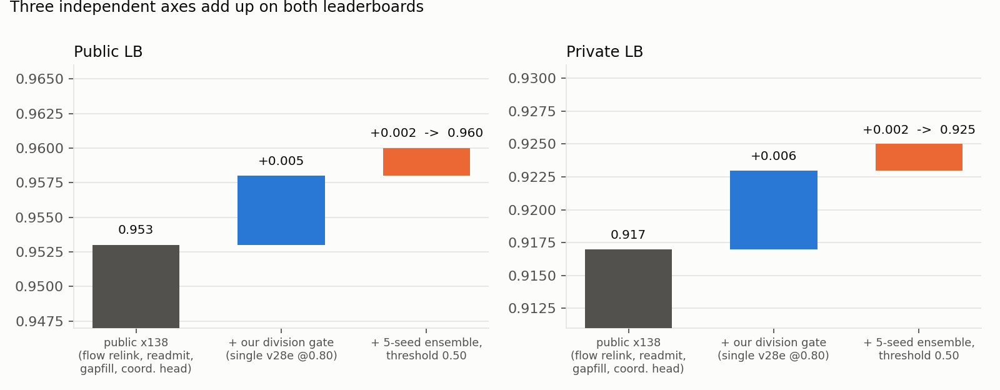
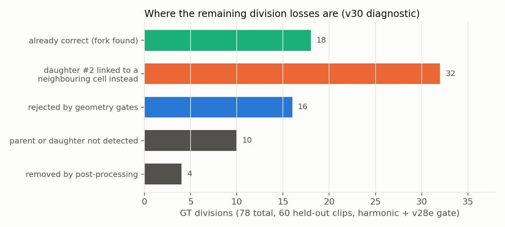
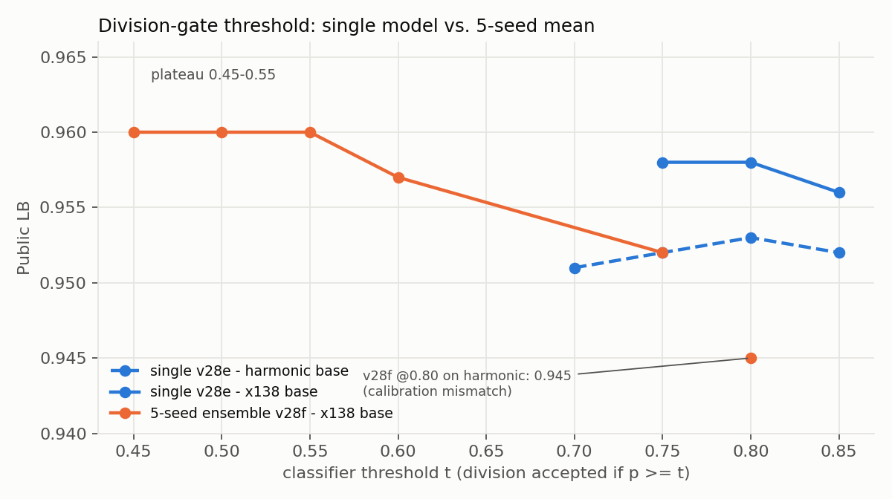
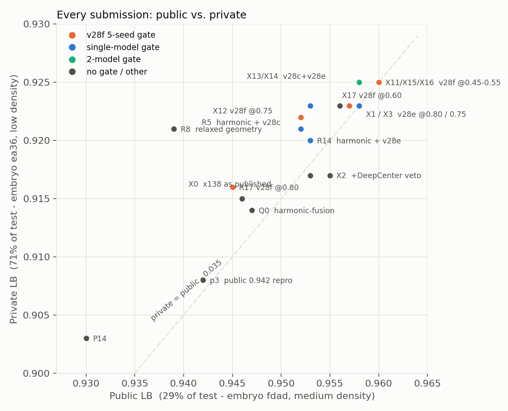

# Division-Gated Post-processing on a Public Detection Pipeline

**Biohub – Cell Tracking During Development · Solution Writeup · Public 0.960 / Private 0.925 · 155th of 3,950 teams (final)**

우리 솔루션은 새 검출기를 학습하는 대신, 공개된 최고 파이프라인의 **후처리 단계에서 분열(division) 결정을 학습 분류기로 게이팅**하고, 그 분류기의 앙상블 임계값을 리더보드로 보정하는 데 집중했습니다. 3주 동안 공개 LB 0.600 → 0.960. 메트릭 해킹은 사용하지 않았습니다.



---

## 1. Overview

최종 파이프라인은 여섯 단계입니다.

| # | 단계 | 내용 | 출처 |
|---|---|---|---|
| 1 | Cell detection | 공개 50-epoch TemporalUNet3D + 두 번째 시드 모델, xy 8방향 TTA, edge-feature TTA, DeepCenter 보조 히트맵 | 공개 x138 |
| 2 | Linking | NodeTransformer 엣지 확률 → tracksdata ILP → flow-prior motion relink → 저점수 검출 readmit → 갭 클로징 → 서브임계 gapfill → 좌표 보정 헤드 | 공개 x138 |
| 3 | Division candidates | 트랙 시작점이 기존 트랙의 부모 근처에 있을 때 (부모, 기존 자식, 후보 자매) 삼중을 기하 조건으로 생성 | 공개 harmonic |
| 4 | **Division gate** | 부모 중심 4프레임 크롭을 3D-CNN이 채점, **5시드 sigmoid 평균 ≥ 0.55**일 때만 분열 채택. DeepCenter 거부 off | **ours** |
| 5 | Post-processing | 6노드 미만 성분 제거, 선형 스무딩 | 공개 |
| 6 | **Model selection** | 로컬 홀드아웃이 LB와 반대로 움직임을 확인한 뒤, 마지막 주는 LB 제출을 유일한 검증으로 사용 | **ours** |

세 축이 독립이라 이득이 그대로 합산됐습니다 — public과 private 양쪽에서.

| 축 | Public | Private |
|---|---|---|
| 공개 x138 원본 | 0.953 | 0.917 |
| + 우리 분열 게이트 (단일 v28e @0.80) | 0.958 (+0.005) | 0.923 (+0.006) |
| + 5시드 앙상블, 임계값 0.55 | **0.960** (+0.002) | **0.925** (+0.002) |

---

## 2. Data and Validation

| | train | hidden test |
|---|---|---|
| 배아 | `44b6` 71클립 (밀집, 중앙값 ~355세포/프레임) · `6bba` 128클립 (희소, ~114) | `fdad` public 29% (중간 밀도) · `ea36` private 71% (저밀도) |
| 볼륨 | 100프레임 × 64×256×256, voxel z 1.625 / xy 0.406 µm | 동일 |
| 라벨 | 클립당 GT 트랙 1~12개 = 전체 세포의 ~3%. GT 분열 151개 | — |

라벨이 희소하다는 것이 이 대회의 핵심 제약이었습니다. 분열 분류기의 학습 데이터를 GT에서 직접 만들 수 없어 파이프라인 후보를 덤프해 라벨링해야 했고(§5), 검증 세트를 학습 세트와 분리하는 데 실패했습니다(§7).

메트릭(`adjusted_edge_jaccard + 0.1 × division_jaccard`)을 그대로 재구현한 로컬 채점기를 만들어 사용했습니다. 초반(DoG 단계)에는 12클립 CV가 LB와 순서 일치(CV ≈ LB + 0.02~0.03). 후반의 **타입별 30클립 = 60클립 홀드아웃**은 분류기 AUC와 후처리 노브 모두 LB와 반대로 갔습니다. 원인은 (a) 검증 클립이 분류기 학습셋에 포함, (b) hidden 배아의 밀도 분포가 두 train 배아와 다름. 결국 마지막 주 검증은 LB 제출 5회/일로 대체했습니다.

---

## 3. Cell Detection — 자체 학습에서 공개 가중치로

세 단계를 거쳤습니다.

| 단계 | 검출기 | 링커 | 최고 |
|---|---|---|---|
| (1) v2~v12 | 비등방 DoG + 국소 최댓값, 밀도 기반 클립별 반경 `r = 26.5·N^(−1/3)` | Trackastra(CTC 사전학습 → 파인튜닝) greedy | LB 0.798 |
| (2) v13~v17 | 주최측 TemporalUNet3D 자체 학습 4 epoch (2.5 h/epoch) | NodeTransformer + tracksdata ILP | CV 0.855 |
| (3) v18~ | 공개 50-epoch 가중치 (pilkwang) + 공개 파이프라인 | 〃 + relink/readmit/gapfill | LB 0.953 (x138) |

(1)에서 배운 것: 배아마다 세포 크기가 다르다. 반경 5.0 µm는 희소 배아에서 0.86~0.95, 밀집 배아에서 recall 0.51. 프레임당 검출 수로 반경을 자동 결정해 CV 0.641 → 0.793. 하지만 고전 검출기는 밀집 영역·분열 직후를 놓쳐 0.9+가 불가능했습니다.

(2)에서 배운 것: greedy 0.64 vs ILP 0.84(ILP 필수), TTA +0.02, 초반 미숙 검출기의 수천 개 피크가 어텐션 n² OOM을 내므로 프레임당 top-K 상한이 필요. 4 epoch 모델(0.855)이 공개 50-epoch(0.913~0.94)와 격차가 커서 남은 GPU로 메울 수 없다고 판단.

(3)에서 배운 것: 공개 노트북 7개를 코드 diff로 대조하면 실제로 다른 코드는 2개(harmonic-fusion 0.947, x138 0.953)뿐. x138의 개선은 전부 엣지 쪽이고 분열 코드는 harmonic과 170줄 동일. 최종 검출기·링커는 x138 그대로이며, 우리가 바꾼 것은 §5의 게이트와 §6의 임계값입니다.

---

## 4. Linking

공개 x138 그대로입니다.

| 단계 | 설정 |
|---|---|
| ILP | appearance 0 · disappearance 2.0 · division 1.2 · timeout 1200 s (visible 최대 클립 76k 노드에서 78 s) |
| motion relink | tight 5.5 µm; flow 사전분포 — 이웃 K=12 세포의 중앙값 변위, gate 7.0 µm |
| readmit | ILP가 버린 검출 중 점수 ≥ 0.965이고 열린 트랙 끝에서 4 µm 이내 → 재입장 → 2차 relink |
| gap closing | 1·2프레임 (밀도 적응 반경) |
| gapfill | 서브임계 피크(≥ 0.5)로 최대 3프레임 갭 연결 |
| 좌표 보정 | 검출기 특징 위의 작은 회귀 헤드(V1284)로 중심 좌표를 최대 2 µm 이동 |

60클립 홀드아웃으로 이 노브들을 스윕했을 때(§7) 검증기는 `flow gate 7→6, K 12→16`을 +0.0016으로 선택했지만 LB에서는 −0.002였습니다. readmit/gapfill을 끄면 검증기에서 각 −0.0008 → 둘 다 실제로 기여함. 작성자의 기본값을 유지했습니다.

---

## 5. Division Identification (ours)

### 왜 여기인가

공개 노트북들이 싣고 다니던 "DivNet" 분류기는 **실제로 호출되지 않는 코드**였습니다(`if OUTPUT_DIVISION_GEOMETRY_FILTER:` 안, 값이 False; 6-D 텐서 버그를 try/except가 삼킴). 분열은 `add_safe_divisions_postlink`의 기하 조건 + DeepCenter 히트맵 거부로만 결정되고 있었고, 여기가 파이프라인에서 유일하게 학습 신호가 없는 단계였습니다.

### 학습 데이터

희소 GT에서 분열 라벨을 직접 만들 수 없어, **파이프라인이 실제로 보는 후보를 그대로 덤프**했습니다.

```mermaid
flowchart LR
  A[harmonic 파이프라인\n검증기 on, train 60클립] --> B[safe-division 후보 생성기 후킹\n모든 기하 후보 덤프\n(부모, 기존 자식, 후보 자매)]
  B --> C{7 µm 이분 매칭\nvs 희소 GT}
  C -->|부모 = GT 분열 노드\n후보 = 그 딸| P[양성]
  C -->|부모 = GT 노드\n자식 1개| N[음성]
  C -->|미매칭| X[제외]
  G[GT 분열 위치 크롭\n195클립 전체] --> P
  P & N --> D[(1,564 샘플\n양성 183)]
```

v28b(60클립) → v28d(+80클립). 남은 55클립은 전부 6bba로 GT 분열이 0개라 사용 불가.

### 모델

| 항목 | 값 |
|---|---|
| 입력 | 부모 중심 크롭 4프레임(t..t+3, 클램프)을 채널로 → (4, 16, 32, 32), z_pad 8 / xy_pad 16, 크롭별 평균·표준편차 정규화 |
| 구조 | 3-블록 3D-CNN(16-32-64) + GAP + FC, BCE |
| 학습 | 60 epoch, AdamW, 시드별 홀드아웃 AUC로 best 선택 |

| 체크포인트 | 학습 클립 | 시드 | 홀드아웃 AUC | LB (x138 위, 최적 임계값) | Private |
|---|---|---|---|---|---|
| v28c | 60 | 1 | 0.948 | 0.952 (harmonic 위 @0.80) | 0.921 |
| v28e | 140 | 1 | 0.959 | 0.958 @0.80 | 0.923 |
| **v28f** | 140 | **5 (앙상블)** | 0.962 | **0.960 @0.45~0.55** | **0.925** |
| v28c + v28e | — | 2모델 평균 | — | 0.958 @0.75/0.80 | 0.925 |

### 게이트

분열이 실제로 결정되는 후보 루프에, DeepCenter 거부 바로 뒤에 `분류기 확률 ≥ threshold` 조건을 삽입. DeepCenter 거부는 끄는 편이 일관되게 나았습니다.

| 베이스 | 거부 on, 게이트 없음 | 거부 off + 게이트 | 거부 on + 게이트 |
|---|---|---|---|
| harmonic | 0.947 | **0.952** (R5) | — |
| x138 | 0.953 | **0.958** (X1) | 0.955 (X2) |

크롭이 부모 좌표만으로 정해지므로 (클립, t, 부모 좌표) 키로 memo해 재채점 비용을 없앴습니다.

### 진단 — 남은 분열 손실은 어디에



60클립의 GT 분열 78개 중 가장 큰 버킷(32개)의 "다른 부모"는 전부 진짜 부모에서 5~7 µm 이상 떨어진 **GT 미매칭 노드 = annotation 없는 진짜 이웃 세포**였습니다(중복 검출이 아님; 31/35에 들어오는 엣지가 있음). 딸 #2를 진짜 부모로 되돌리는 가로채기(neighbour steal, 분류기 게이트 포함)와 중복 부모 병합은 LB 중립(0.953 → 0.953). 링킹 단계에서 이웃 세포와의 경쟁을 이겨야 풀리는 문제이고, 3위 솔루션이 "링크와 분열을 함께 최적화"한 이유와 정확히 같은 지점입니다(§9).

---

## 6. Ensemble Calibration (ours)

5시드 앙상블(v28f)은 홀드아웃 AUC가 단일보다 높은데 LB는 **0.945**(단일 0.953)로 크게 나빴습니다. 시드별 sigmoid를 평균하면 확률이 중앙으로 눌려, 단일 모델용 임계값 0.80이 사실상 0.9+ 기준이 된다는 가설을 세우고 LB로 곡선을 그렸습니다.



| v28f 임계값 | 0.80 | 0.75 | 0.60 | **0.55** | **0.50** | **0.45** |
|---|---|---|---|---|---|---|
| Public | 0.945 | 0.952 | 0.957 | **0.960** | **0.960** | **0.960** |
| Private | 0.916 | 0.922 | 0.923 | **0.925** | **0.925** | **0.925** |

단일 v28e는 0.75~0.80이 최적(0.958), 2모델 평균(v28c+v28e)은 덜 눌려 0.75/0.80에서 0.958. 최종 제출은 0.55(플라토 0.45~0.55 안, 세 값 모두 public 0.960 / private 0.925).

---

## 7. What Didn't Work

전부 실제 LB로 확인한 결과입니다.

| 시도 | Public Δ | 비고 |
|---|---|---|
| 분열 기하 조건 완화 (반경 9→11 µm 등) | **−0.013** | 가장 큰 손해 |
| 5시드 앙상블 @0.80 | −0.008 | 캘리브레이션 문제 (§6에서 해결) |
| DeepCenter 거부를 게이트와 병행 | −0.003 | private에서도 −0.006 |
| 분류기 TTA 16뷰 (D4 × z-flip) | −0.002 | |
| flow gate / K 변경 (60클립 검증기 선택값) | −0.002 | 검증기와 반대 |
| 분류기 임계값 0.85 (단일) | −0.002 | |
| 포크 게이트 (기존 분열에도 분류기 적용) | 0 | |
| ILP division weight 1.2 → 1.0 | 0 | |
| 이웃 세포에서 딸 #2 가로채기 | 0 | 27→100건 옮겨도 동일 |
| 중복 부모 병합 | 0 | 대상 0건 |
| 검출 임계값 0.965 → 0.96 | 0 | |
| 공개 400ep 가중치 이어 학습 → 3번째 시드 | 0 | |

**60클립 홀드아웃 스윕(v34).** x138의 새 노브 16개 후보를 10시간 스윕. 선택된 `flow 6.0/16`은 검증기 +0.0016 → LB −0.002. 그리고 **검증기가 켜진 노트북을 그대로 제출해 Timeout 1회** — 제출 노트북은 hidden 세트로 처음부터 재실행되므로 12h를 넘겼습니다.

---

## 8. Submission and Results

| 슬롯 | 설정 | Public | Private |
|---|---|---|---|
| 1 | x138 + v28f 5시드 게이트 @0.55 (X11) | 0.960 | **0.925** |
| 2 | x138 + v28e 단일 게이트 @0.80 (X1) | 0.958 | 0.923 |

최종 private 0.925, **155위 / 3,950팀** (public 133위 → −22; 최종 확정). 두 번째 슬롯을 같은 앙상블의 인접 임계값이 아닌 **다른 분류기**로 둔 이유: 최종 순위는 둘 중 private 최고로 정해지므로, 출력이 거의 같은 둘을 고르면 슬롯 하나가 비는 것과 같기 때문입니다.

### Public → Private



| | Public | Private | 차이 |
|---|---|---|---|
| Q0 (공개 harmonic 원본) | 0.947 | 0.914 | −0.033 |
| X0 (공개 x138 원본) | 0.953 | 0.917 | −0.036 |
| R14 (harmonic + v28e 게이트) | 0.953 | 0.920 | −0.033 |
| X1 (x138 + v28e 게이트) | 0.958 | 0.923 | −0.035 |
| X11 / X15 / X16 (x138 + v28f @0.55/0.45/0.50) | 0.960 | 0.925 | −0.035 |
| X13 / X14 (v28c+v28e) | 0.958 | 0.925 / 0.924 | |
| X2 (DeepCenter 거부 병행) | 0.955 | 0.917 | |
| R17 (v28f @0.80) | 0.945 | 0.916 | |

읽는 법: (1) **우리 게이트의 이득은 private에서도 유지**됐습니다 — x138 원본 0.917 → 게이트 0.923 → 앙상블 0.925 (+0.008). 임계값 순서와 손해 방향(DeepCenter 병행, flow 변형)도 public과 같습니다. (2) 반면 **베이스 파이프라인 구간에서 −0.035** 떨어졌습니다. 같은 public 대역(100~175위, 3칸 간격 25팀, 2026-09-30 예비 private LB 조회)의 평균 낙폭도 −0.034(중앙값 −0.034, 범위 −0.027~−0.041)라, 이 대역 전반에서 비슷하게 떨어졌습니다. 공개 x138/harmonic 계열이 public 배아(fdad, 중간 밀도)에 맞춰져 있었다는 것이 유력한 가설이지만 확인되지는 않았습니다(3위 솔루션은 −0.010). 원인이 무엇이든, 다른 배아로의 일반화를 미리 검증할 장치를 갖추지 못한 것은 우리 몫입니다.

**최종 확정 결과 (2026-10-02 추가).** Kaggle 검증 후 리더보드가 확정됐습니다. Private 0.92504로 **155위 / 3,950팀**이며, 대회 직후 예비 집계보다 한 계단 올랐고 검증 과정에서 70팀이 빠졌습니다. 최종 선택 2개는 X11(Private 0.92504 / Public 0.96047)과 X1(Private 0.92366 / Public 0.95847)입니다. 소수점 다섯째 자리까지 보면 선택하지 않은 X13(v28c+v28e @0.75, Private 0.92559)과 X15(v28f @0.45, Private 0.92548)가 X11보다 약 0.0005 높았습니다. 선택 기준이던 Public에서는 X11(0.96047)이 X13(0.95847)·X15(0.96046)보다 높았으므로, Public만으로는 고를 수 없던 차이입니다.

Kaggle Input: Competition + `pilkwang/biohub-tracking-support-pack-50ep-v1` + `pilkwang/biohub-temporal-unet3d-seed314159-v1` + `pilkwang/biohub-deepcenter-unet3d-center-prior-v1` + `biohub-v1284-head-s075` + 분류기 학습 노트북 Output. 실행 ~25분(T4×2).

---

## 9. Comparison with the 3rd-Place Solution

3위(yu4u, public 0.977 / private 0.967)와 우리(public 0.960 / private 0.925)를 단계별로 나란히 놓으면 차이가 어디서 났는지 분명합니다.

| 단계 | 3rd place | Ours |
|---|---|---|
| 검출 | 2.5D U-Net(EffNetV2-L 0.3, B7 0.4) + 3D SegResNet(0.3) **3모델 앙상블**, 5-fold, 희소 라벨용 **DoG 마스킹 손실**(미매칭 DoG 후보 6 µm 주변을 손실에서 제외), 자체 학습. 런타임의 55% | 공개 50-epoch TemporalUNet3D + 시드 1개 (학습 안 함) |
| 모션 | **학습된 dense flow**(3D 변위장, 합성 데이터 지도 + 비지도 일관성) | 이웃 세포 중앙값 흐름(x138) |
| 링크 스코어 | 전용 matcher(EffNetV2-S + self/cross-attention, null 옵션, 양방향 CE) | 공개 NodeTransformer 엣지 확률 |
| 분열 | parent 모델(원본 + flow 정렬 5볼륨) + pre/post 보조 모델, 5-fold × 4회전 | 부모 크롭 4프레임 3D-CNN, 5시드 |
| 그래프 결정 | 확률 캘리브레이션(평가될 확률 a × 정답 확률 q → 기대 TP/FP) → **링크·분열 공동 LP/MILP**(HiGHS), 메트릭 대리 목적함수 | ILP(링크) → 기하 후보 → 분류기 게이트 (순차) |
| 후처리 | 갭 클로징(1~3프레임) → 6노드 미만 제거 → **affine 좌표 정제 ×2** | 갭 클로징(1~2) → 6노드 미만 제거 → 선형 스무딩 (공개 그대로) |
| 검증 | 비디오 단위 5-fold OOF, 캘리브레이션 모델도 fold 제외; test 배아 밀도 프로빙 | 60클립 홀드아웃 → LB와 불일치 → LB 직접 검증 |
| 최종 | CV 0.9778 / public 0.977 / **private 0.967** (−0.010) | public 0.960 / **private 0.925** (−0.035), 155위 |

**3위의 ablation이 말해주는 것.** 검출 + 단순 Hungarian만으로 0.890, flow와 matcher를 더해도 0.902에 머물다가, **분열 모델 + 캘리브레이션 + 공동 최적화(A3)에서 0.964**로 뛰었습니다. 우리도 같은 결론을 다른 길로 얻었습니다 — 공개 파이프라인에서 유일하게 학습 신호가 없던 분열 결정에 분류기를 넣은 것이 +0.005~0.008로 가장 큰 단일 개선이었고, 진단(§5)에서 남은 분열 손실의 40%가 "딸이 이웃 세포에 먼저 링크됨"이라는 **순차 결정의 한계**였습니다. 3위가 "링크를 먼저 고정하면 올바른 딸이 다른 부모에 배정될 수 있으므로 함께 선택한다"고 쓴 이유가 정확히 그 지점입니다.

| 3rd place ablation | adjJ | divJ | total |
|---|---|---|---|
| A0 검출 + Hungarian(드리프트 보정) | 0.890 | 0.000 | 0.890 |
| A1 + dense flow | 0.902 | 0.000 | 0.902 |
| A2 + matcher 후보 필터 | 0.902 | 0.000 | 0.902 |
| **A3 + 분열 모델·캘리브레이션·공동 최적화** | 0.911 | 0.535 | **0.964** |
| A4 + 갭 클로징 | 0.916 | 0.535 | 0.970 |
| A5 + 6노드 미만 제거 | 0.918 | 0.532 | 0.971 |
| A6 + affine 좌표 정제(검출) | 0.923 | 0.540 | 0.977 |
| A7 + affine 좌표 정제(보간) | 0.924 | 0.540 | 0.978 |

**Public→Private 낙폭이 말해주는 것.** 3위는 −0.010, 우리는 −0.035입니다. 다만 우리와 같은 public 대역 25팀의 평균 낙폭도 −0.034였으므로, 이 차이는 우리 파이프라인만의 문제라기보다 이 대역이 공유한 성질로 보입니다. 3위는 두 test 배아의 밀도 분포가 다르다는 것을 프로빙으로 확인하고 비디오 단위 5-fold로 모델을 골랐습니다. 우리는 public LB를 유일한 검증으로 썼기 때문에, public 배아에 맞춰진 공개 파이프라인의 편향을 물려받았을 가능성이 있습니다(추정). 우리가 얹은 게이트는 private에서도 +0.008을 유지했지만, 베이스가 흔들리는 것을 막을 장치는 없었습니다.

**우리가 못 한 것.** (1) 검출기 학습 — 4 epoch에서 멈추고 공개 가중치로 갔습니다. 3위는 검출이 런타임의 55%를 차지할 만큼 여기에 투자했고, 희소 라벨을 다루는 마스킹 손실이 핵심이었습니다. (2) 좌표 정제 — affine 정제 두 단계로 +0.0065를 얻었는데(A5→A7), 우리는 공개 좌표 보정 헤드를 그대로 썼습니다. (3) 검증 — 5-fold OOF 대신 60클립 홀드아웃을 썼고, 그것이 학습셋과 겹쳐 신뢰를 잃었습니다.

**우리가 맞게 한 것.** (1) 개선 축을 분리해 독립성을 확인하고 합산. (2) 앙상블 캘리브레이션을 LB 곡선으로 직접 보정(3위는 이를 로지스틱/GBM 캘리브레이션 모델로 체계화). (3) 공개 노트북을 diff로 읽어 "호출되지 않는 분류기"와 "코드가 같은 7개 노트북"을 걸러낸 것.

---

## 10. Lessons

1. **독립인 개선은 합산된다.** 엣지 축과 분열 축을 따로 검증하고 합쳤을 때 이득이 그대로 더해졌다 — public과 private 양쪽에서. 같은 축을 다른 방식으로 건드린 시도는 전부 중립이었다.
2. **로컬 검증기는 "무엇을 검증하는지"가 중요하다.** 학습셋과 겹치는 홀드아웃, hidden과 다른 밀도 분포 — 두 가지 이유로 60클립 검증기는 LB와 반대로 갔다.
3. **앙상블은 캘리브레이션까지 맞춰야 한다.** 같은 모델이 임계값 0.80에서 −0.008, 0.50에서 +0.002.
4. **순차 결정은 분열에서 한계가 있다.** 링크를 먼저 확정하면 딸이 이웃에 빼앗긴다. 다음에는 공동 최적화(3위 방식)부터.
5. **제출 노트북 = hidden 재실행.** 검증기 켠 노트북은 Timeout.
6. **Public LB는 한 배아다.** 두 test 배아의 밀도가 다르면 public에 맞춘 것은 private에서 흔들린다(−0.035). 배아 단위 홀드아웃(한 배아로 학습, 다른 배아로 검증)이 우리에게 없던 검증이었다.

---

## Code

- `notebooks/05_x138_final/biohub_v33_x138_divnet_variants.ipynb` — 최종 제출 노트북 (`VARIANT`로 X0~X19 전환)
- `notebooks/04_division_classifier/` — 후보 덤프·라벨링(v28b/d), 분류기 학습(v28e/f), 진단(v30/v31)
- `src/divnet_blk1.py`, `src/divnet_blk2.py` — 분류기 정의·로더·스코어러
- `builders/` — 공개 노트북 원본 + 패치로 각 노트북을 재생성하는 스크립트
- `docs/figures/` — 이 문서의 그림

공개 자료: royerlab baseline, Trackastra, pilkwang 가중치 3종, 공개 노트북 계열(0.942 → harmonic-fusion → x138), `biohub-v1284-head-s075`, 3위 write-up(yu4u).
